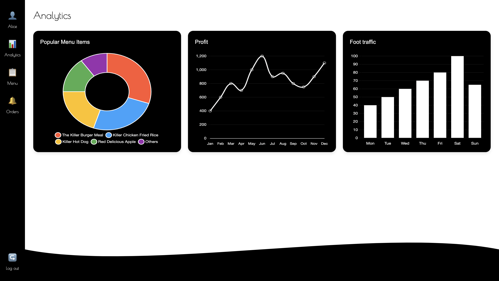
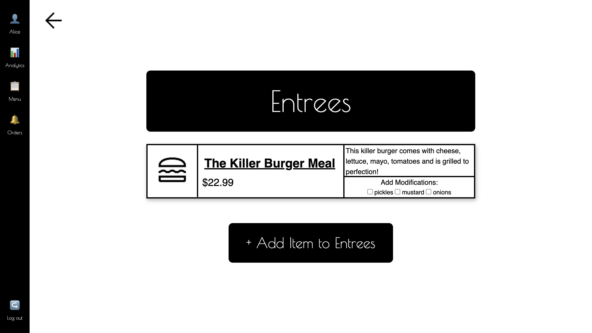

# KillerSale POS System


## Team Members
- Kyumin Lee
- Lyndsey Dong
- Raleigh Savage
- Ben Yokell

A human-centered Point of Sale system designed for small businesses with a focus on minimizing cognitive load and maximizing efficiency.
- **All-in-One POS**: Manage both business and customer interfaces in a single application
- **Real-Time Analytics**: View menu popularity, profit trends, and foot traffic through intuitive visualizations
- **Custom Menu Creation**: Easily create and modify menu items with descriptions, prices, and modifications
- **Order Tracking**: Monitor current and past orders with clear status indicators
- **Responsive Design**: Works seamlessly across desktop, tablet, and mobile devices
- **Offline Capability**: Continue core operations during internet outages with automatic synchronization

## Screenshots


*Welcome page with key features and navigation*


*Analytics dashboard showing sales data visualizations*


*Menu creation and management interface*


## Installation & Setup
1. Clone the repository
```
git clone https://github.com/rnaskdl/HCI.git
```
2. Navigate to the project directory
```
cd killersale
```
4. Open index.html in your browser or use a local development server


Libraries used:
Charts.js
https://www.chartjs.org/docs/latest/getting-started/installation.html
```
npm install chart.js
```


File structure
```
/
├── index.html (redirects to analytics page)
├── README.md
├── assets/
│   ├── css/
│   │   ├── main.css (shared styles)
│   │   ├── components/
│   │   │   └── sidebar.css
│   │   └── pages/
│   │       ├── analytics.css
│   │       ├── authentication.css
│   │       ├── entrees.css
│   │       ├── groupCustomers.css
│   │       ├── menu.css
│   │       ├── menuDashboard.css
│   │       ├── orders.css
│   │       ├── profile.css
│   │       └── welcome.css
│   ├── js/
│   │   ├── common/
│   │   │   └── common.js
│   │   └── pages/
│   │       ├── analytics.js
│   │       ├── authentication.js
│   │       ├── entrees.js
│   │       ├── groupCustomers.js
│   │       ├── menu.js
│   │       ├── profile.js
│   │       ├── trueCheckout.js
│   │       └── welcome.js
│   └── img/
│       ├── AllInOne.png
│       ├── Analytics.png
│       ├── apple-whole-solid.svg
│       ├── backArrow.png
│       ├── bowl-food-solid.svg
│       ├── dawg.svg
│       ├── defaultImage.png
│       ├── definitelySoda.png
│       ├── frenchBagel.png
│       ├── killerBurger.png
│       ├── KillerWhale.png
│       ├── martini.png
│       ├── MenuCreation.png
│       └── Orders.png
└── pages/
    ├── analytics/
    │   └── index.html
    ├── authentication/
    │   └── index.html
    ├── customerVIew/
    │   ├── drinksCustomer.html
    │   ├── entreesCustomer.html
    │   ├── menuDashboard.html
    │   ├── sidesCustomer.html
    │   ├── trueCheckout.html
    │   └── viewCart.html
    │   ├── orders.js
    │   └── index.html
    ├── FAQ/
    │   └── index.html
    ├── menu/
    │   ├── entrees.html
    │   └── index.html
    ├── orders/
    │   ├── orders.js
    │   └── index.html
    └── profile/
        └── index.html
```
